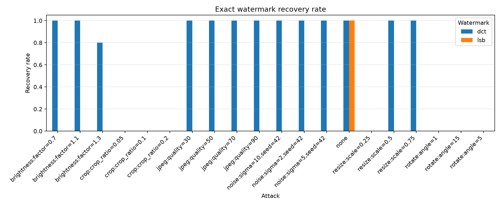
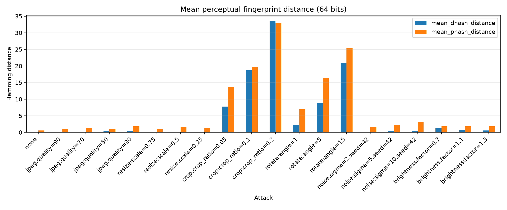
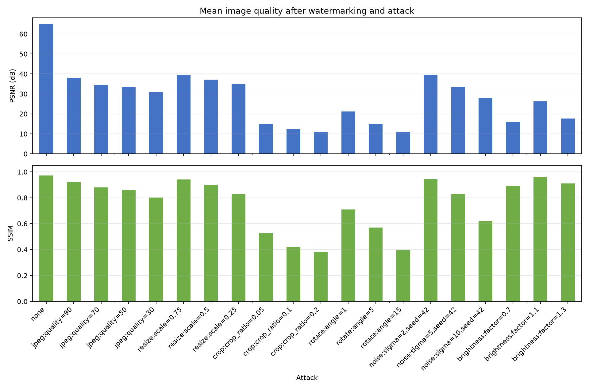

# Watermarking & Fingerprinting Robustness Benchmark

[English](README.en.md)

画像ウォーターマークと知覚フィンガープリントが、一般的な画像加工にどの程度耐えられるかを、再現可能な条件で測定する学習・検証プロジェクトです。

## 背景と目的

クリエイターの画像は、配信過程で圧縮、リサイズ、切り抜きなどの加工を受けます。本プロジェクトでは、埋め込んだ識別情報を加工後も復元できるか、また加工画像を元画像と同一・類似コンテンツとして識別できるかを比較します。

検証する問いは次の3点です。

1. LSB方式とDCT方式では、加工後のペイロード復元率がどう異なるか。
2. 埋め込み強度・耐性と、PSNR・SSIMで測る画質の間にどのようなトレードオフがあるか。
3. dHashとpHashの距離は、加工の種類と強度に対してどう変化するか。

## 脅威モデル

対象は、画像の内容を大きく変えずに再配布する際の次の変換です。

- JPEG再圧縮
- 縮小後の再拡大
- 中央切り抜き後の再拡大
- 回転
- ガウシアンノイズ
- 明るさ変更

秘密鍵を知る攻撃者による除去、生成AIによる再生成、幾何補正を伴う高度な同期攻撃、暗号学的な真正性証明は対象外です。この実装は学習用であり、DRMや著作権侵害の自動判定には使用できません。

## 実装方式

| 分類 | 方式 | 役割 |
|---|---|---|
| ウォーターマーク | LSB | 画素の最下位ビットへ埋め込む、壊れやすい比較基準 |
| ウォーターマーク | block-DCT | 中間周波数係数の大小関係へ反復埋め込み |
| フィンガープリント | dHash | 隣接画素の輝度差を64ビットで表現 |
| フィンガープリント | pHash | DCT低周波成分を64ビットで表現 |

DCT方式では同じビットを奇数回埋め込み、抽出時に多数決します。`strength`を高くすると係数差が広がるため耐性向上が期待できますが、画質劣化とのトレードオフがあります。

## 処理フロー

```text
入力画像 ──┬── ウォーターマーク埋め込み ── 攻撃シミュレーション ── 抽出判定
           │                                      │
           └── 元画像の知覚ハッシュ ───────────────┼── ハミング距離
                                                  │
元画像 ──────────────────────────────────────────┴── PSNR / SSIM
```

各画像・方式・攻撃条件の組み合わせを評価し、生データ、集計、グラフ、Markdownレポートを自動生成します。

## セットアップ

```bash
python3 -m venv security
source security/bin/activate
python -m pip install -e '.[dev]'
```

依存ライブラリは`security`仮想環境のみにインストールします。

## ベンチマークの再現

```bash
source security/bin/activate
python examples/generate_samples.py
watermark-benchmark --config configs/default.yaml
```

`results/default/`に次が生成されます。

- `raw_results.csv`: 画像単位の全測定値
- `summary.csv`: 方式・攻撃条件ごとの平均
- `report.md`: Markdown形式の実行レポート
- `watermark_detection_rate.png`: ペイロード完全復元率
- `fingerprint_distance.png`: dHash・pHashの平均ハミング距離
- `image_quality.png`: 平均PSNR・SSIM

## 初期実験結果

合成画像3枚に加えて、自分で追加した写真画像2枚（`beach.png`, `myself.png`）を含む計5枚、識別子`creator-123`、DCT強度45・反復5で、200組み合わせを実行した結果です。小規模なデータによるパイプライン確認であり、方式一般の性能を示す結論ではありません。

| 条件 | LSB完全復元率 | DCT完全復元率 |
|---|---:|---:|
| 加工なし | 100% | 100% |
| JPEG品質90 / 70 / 50 / 30 | すべて0% | すべて100% |
| リサイズ75% / 50% | 0% | 100% |
| リサイズ25% | 0% | 0% |
| 中央切り抜き5% / 10% / 20% | すべて0% | すべて0% |
| 回転1° / 5° / 15° | すべて0% | すべて0% |
| ノイズσ=2 / 5 / 10 | すべて0% | すべて100% |
| 明るさ0.7 / 1.1 | 0% | 100% |
| 明るさ1.3 | 0% | 80% |

加工なしのDCT埋め込み画像は平均PSNR 39.63 dB、平均SSIM 0.946でした。LSBは加工なしでは完全復元できる一方、JPEG圧縮・リサイズ・切り抜き・回転・ノイズ・明るさ変更のすべてで復元に失敗しました。DCTはJPEG圧縮、軽いリサイズ、ノイズ、明るさ変更に比較的強い一方、切り抜きや回転では8×8ブロック境界との同期を失いやすく、今回の条件では復元できませんでした。

全測定値と画像単位の失敗は`results/default/raw_results.csv`、集計値は`summary.csv`で確認できます。







任意の画像を使う場合は、画像フォルダを用意し、[configs/default.yaml](configs/default.yaml)の`dataset_dir`を変更してください。DCT方式は8×8ブロックを使用し、反復回数に応じた容量が必要です。

## 個別API

```python
from watermark import dct, lsb
from attacks import jpeg_compression

marked = dct.embed(image, b"creator-id", strength=45, repetition=5)
attacked = jpeg_compression(marked, quality=70)
payload = dct.extract(attacked, repetition=5)

fragile = lsb.embed(image, b"creator-id")
payload = lsb.extract(fragile)
```

LSB画像はPNGなどの可逆形式で保存してください。JPEG保存すると通常はヘッダーを含む埋め込み情報が破壊されます。

フィンガープリント比較CLIも利用できます。

```bash
image-fingerprint image-a.jpg image-b.jpg --algorithm phash
image-fingerprint image-a.jpg image-b.jpg --algorithm dhash --hash-size 8
```

## 評価指標

- 完全復元率: 抽出した全バイトが埋め込んだペイロードと一致した割合
- PSNR: 元画像に対する画素誤差。高いほど差が小さい
- SSIM: 元画像との構造的類似度。1に近いほど類似
- ハミング距離: 64ビット知覚ハッシュ間で異なるビット数

類似判定の閾値はデータセットに依存するため、本実装では固定していません。異なる画像同士の距離も測定し、偽陽性率・偽陰性率から決める必要があります。

## テスト

```bash
source security/bin/activate
pytest
```

ウォーターマークの往復、JPEG耐性、攻撃処理、パラメータ検証、フィンガープリント、画質指標を自動テストします。ノイズ攻撃は乱数シードを固定でき、実験を再現できます。

## 現時点の限界

- DCT抽出は8×8ブロック境界に依存し、切り抜きや回転で同期を失いやすい
- 反復多数決は単純な冗長化であり、BCHやReed–Solomonなどの誤り訂正符号ではない
- ペイロードは暗号化・署名されておらず、所有者の真正性を証明しない
- 現在の画像5枚は動作確認用で、統計的な結論を出すには不足している
- 画像全体の意味的類似性や生成AIによる改変は評価していない

今後は、公開データセットの導入、誤り訂正符号、同期マーカー、攻撃強度ごとの信頼区間、異画像ペアを含むROC評価が候補です。

## ディレクトリ構成

```text
configs/                 実験条件
docs/                    設計・調査資料
examples/                再現可能なサンプル生成
results/                 自動生成される測定結果
src/attacks/             画像加工・攻撃
src/evaluation/          指標、集計、グラフ、レポート
src/fingerprint/         dHash・pHash
src/watermark/           LSB・DCTウォーターマーク
tests/                   自動テスト
```
