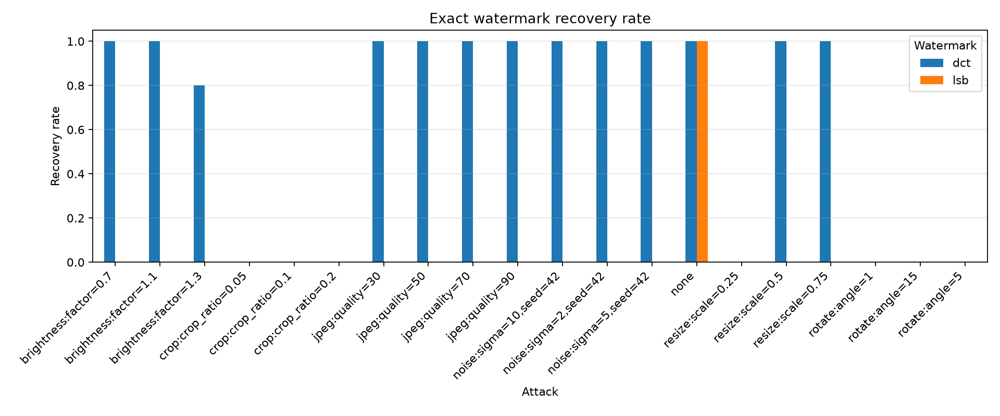

# Watermarking & Fingerprinting Robustness Benchmark

[English](README.en.md)

LSBおよびblock-DCTウォーターマーク、dHash／pHashフィンガープリントを実装し、6種類の画像加工に対する耐性を評価した学習・検証プロジェクトです。DCT方式はJPEG圧縮や軽度のリサイズには耐えた一方、回転・切り抜きでは8×8ブロックの同期を失い、抽出に失敗しました。

付属の`zkp_demo`では、セキュリティ学習の別テーマとして、正確な年齢や生年月日を検証者へ渡さず「指定年齢以上」という条件だけを確認する概念デモも扱います。

## 代表結果

最新の応募用スナップショットは、合成画像3枚と自分で撮影した写真2枚の計5枚、識別子`creator-123`、DCT強度45・反復5を用いた200評価です。

| 評価項目 | 結果 |
|---|---:|
| DCT：JPEG品質90 / 70 / 50 / 30 | すべて完全復元率100% |
| DCT：リサイズ75% / 50% | 完全復元率100% |
| DCT：リサイズ25% | 完全復元率0% |
| DCT：切り抜き5% / 10% / 20% | すべて完全復元率0% |
| DCT：回転1° / 5° / 15° | すべて完全復元率0% |
| 無加工DCT画像の画質 | 平均PSNR 39.63 dB、平均SSIM 0.946 |

今回の5枚は方式一般の性能を示すには少なく、回転・切り抜きへの同期対策、BER、異画像ペアを含むROC評価が未解決です。詳細値の唯一の記録は、保存済みの[生成レポート](results/application_snapshot/report.md)と[集計CSV](results/application_snapshot/summary.csv)です。



## 最短の再現手順

```bash
python3 -m venv security
source security/bin/activate
python -m pip install -e '.[dev]'
python examples/generate_samples.py
watermark-benchmark --config configs/default.yaml
pytest
```

`examples/generate_samples.py`は公開可能な合成画像3枚を生成します。応募用スナップショットには非公開の自作写真2枚も使用しているため、公開リポジトリだけで再実行した場合は対象画像数と集計値が異なります。

## 背景と目的

クリエイターの画像は、配信過程で圧縮、リサイズ、切り抜きなどの加工を受けます。本プロジェクトでは、埋め込んだ識別情報を加工後も復元できるか、また加工画像を元画像と同一・類似コンテンツとして識別できるかを比較します。

検証する問いは次の3点です。

1. LSB方式とDCT方式では、加工後のペイロード復元率がどう異なるか。
2. 埋め込み強度・耐性と、PSNR・SSIMで測る画質の間にどのようなトレードオフがあるか。
3. dHashとpHashの距離は、加工の種類と強度に対してどう変化するか。

## 脅威モデル

対象は、画像の内容を大きく変えずに再配布する際の次の変換です。

- JPEG再圧縮
- 縮小後の再拡大
- 中央切り抜き後の再拡大
- 回転
- ガウシアンノイズ
- 明るさ変更

秘密鍵を知る攻撃者による除去、生成AIによる再生成、幾何補正を伴う高度な同期攻撃、暗号学的な真正性証明は対象外です。この実装は学習用であり、DRMや著作権侵害の自動判定には使用できません。

## 実装方式

| 分類 | 方式 | 役割 |
|---|---|---|
| ウォーターマーク | LSB | 画素の最下位ビットへ埋め込む、壊れやすい比較基準 |
| ウォーターマーク | block-DCT | 中間周波数係数の大小関係へ反復埋め込み |
| フィンガープリント | dHash | 隣接画素の輝度差を64ビットで表現 |
| フィンガープリント | pHash | DCT低周波成分を64ビットで表現 |

DCT方式では同じビットを奇数回埋め込み、抽出時に多数決します。`strength`を高くすると係数差が広がるため耐性向上が期待できますが、画質劣化とのトレードオフがあります。

## 処理フロー

```text
入力画像 ──┬── ウォーターマーク埋め込み ── 攻撃シミュレーション ── 抽出判定
           │                                      │
           └── 元画像の知覚ハッシュ ───────────────┼── ハミング距離
                                                  │
元画像 ──────────────────────────────────────────┴── PSNR / SSIM
```

各画像・方式・攻撃条件の組み合わせを評価し、生データ、集計、グラフ、Markdownレポートを自動生成します。

## セットアップ

```bash
python3 -m venv security
source security/bin/activate
python -m pip install -e '.[dev]'
```

依存ライブラリは`security`仮想環境のみにインストールします。

## ベンチマークの再現

```bash
source security/bin/activate
python examples/generate_samples.py
watermark-benchmark --config configs/default.yaml
```

`results/default/`に次が生成されます。

- `raw_results.csv`: 画像単位の全測定値
- `summary.csv`: 方式・攻撃条件ごとの平均
- `report.md`: Markdown形式の実行レポート
- `watermark_detection_rate.png`: ペイロード完全復元率
- `fingerprint_distance.png`: dHash・pHashの平均ハミング距離
- `image_quality.png`: 平均PSNR・SSIM

## 保存済みの応募用スナップショット

代表結果は`results/application_snapshot/`に保存しています。生画像と画像単位の全中間結果は含めず、実験条件、集計値、自動生成レポート、3種類のグラフだけを公開対象にしています。

- [実験設定](results/application_snapshot/config.yaml)
- [全40条件の生成レポート](results/application_snapshot/report.md)
- [集計CSV](results/application_snapshot/summary.csv)
- [ウォーターマーク完全復元率](results/application_snapshot/watermark_detection_rate.png)
- [知覚フィンガープリント距離](results/application_snapshot/fingerprint_distance.png)
- [PSNRおよびSSIM](results/application_snapshot/image_quality.png)

LSBは加工なしでは完全復元できる一方、すべての画像加工で復元に失敗しました。DCTはJPEG圧縮、軽いリサイズ、ノイズ、明るさ変更に比較的強く、切り抜きや回転では8×8ブロック境界との同期を失って復元できませんでした。

任意の画像を使う場合は、画像フォルダを用意し、[configs/default.yaml](configs/default.yaml)の`dataset_dir`を変更してください。DCT方式は8×8ブロックを使用し、反復回数に応じた容量が必要です。

## 個別API

```python
from watermark import dct, lsb
from attacks import jpeg_compression

marked = dct.embed(image, b"creator-id", strength=45, repetition=5)
attacked = jpeg_compression(marked, quality=70)
payload = dct.extract(attacked, repetition=5)

fragile = lsb.embed(image, b"creator-id")
payload = lsb.extract(fragile)
```

LSB画像はPNGなどの可逆形式で保存してください。JPEG保存すると通常はヘッダーを含む埋め込み情報が破壊されます。

フィンガープリント比較CLIも利用できます。

```bash
image-fingerprint image-a.jpg image-b.jpg --algorithm phash
image-fingerprint image-a.jpg image-b.jpg --algorithm dhash --hash-size 8
```

## 評価指標

- 完全復元率: 抽出した全バイトが埋め込んだペイロードと一致した割合
- PSNR: 元画像に対する画素誤差。高いほど差が小さい
- SSIM: 元画像との構造的類似度。1に近いほど類似
- ハミング距離: 64ビット知覚ハッシュ間で異なるビット数

類似判定の閾値はデータセットに依存するため、本実装では固定していません。異なる画像同士の距離も測定し、偽陽性率・偽陰性率から決める必要があります。

## テスト

```bash
source security/bin/activate
pytest
```

ウォーターマークの往復、JPEG耐性、攻撃処理、パラメータ検証、フィンガープリント、画質指標を自動テストします。ノイズ攻撃は乱数シードを固定でき、実験を再現できます。

## ZKP年齢条件デモ

次のコマンドは、非公開の生年月日をもとに「2026年8月11日時点で20歳以上」という条件を満たす保証を作り、その改ざんを検証します。出力される公開証明に、生年月日と正確な年齢は含まれません。

```bash
source security/bin/activate
age-proof-demo \
  --birth-date 2000-01-01 \
  --minimum-age 20 \
  --reference-date 2026-08-11
```

> **重要:** これは本物の暗号学的ZKPではありません。信頼できる発行者が生年月日を確認し、条件成立をHMACで保証する学習用の概念デモです。暗号学的な範囲証明、ゼロ知識性の証明、安全な鍵管理などを実装していないため、実際の年齢確認や認証には使用できません。

用語、登場人物、処理フロー、本物のZKPとの違いは[ZKP学習ノート](docs/zkp_notes.md)にまとめています。

## 現時点の限界

- DCT抽出は8×8ブロック境界に依存し、切り抜きや回転で同期を失いやすい
- 反復多数決は単純な冗長化であり、BCHやReed–Solomonなどの誤り訂正符号ではない
- ペイロードは暗号化・署名されておらず、所有者の真正性を証明しない
- 現在の画像5枚は動作確認用で、統計的な結論を出すには不足している
- 画像全体の意味的類似性や生成AIによる改変は評価していない

今後は、公開データセットの導入、誤り訂正符号、同期マーカー、攻撃強度ごとの信頼区間、異画像ペアを含むROC評価が候補です。

## ディレクトリ構成

```text
configs/                 実験条件
docs/                    設計・調査資料
examples/                再現可能なサンプル生成
results/                 自動生成される測定結果
src/attacks/             画像加工・攻撃
src/evaluation/          指標、集計、グラフ、レポート
src/fingerprint/         dHash・pHash
src/watermark/           LSB・DCTウォーターマーク
src/zkp_demo/            年齢条件証明の概念デモ（実用ZKPではない）
tests/                   自動テスト
```
